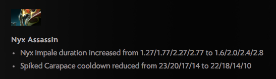

## Predicting MOBA Balance Outcomes
Trevor Fisher

[LinkedIn](https://www.linkedin.com/in/trefish)

#### Background and Summary
In a few more words, this project seeks to predict the effects of game balance updates on character selection in professional MOBA—more specifically, Dota 2—play.

In the MOBA genre, games generally begin with a "pick/ban phase", where each team bans some number of characters from selection by either team, and picks some number of characters to use in the current game. Which characters are feared enough to be targeted with bans or valued highly enough to be picked fluctuates quite a bit over time, and game developers will periodically intervene to balance the characters against each other.

Developer intervention usually looks something like this.

With that context in mind, my goal more concretely is to observe the state of competitive play before a balance update ("patch"), as well as the changes to the characters proposed in the patch, and predict each character's new pick and ban rate following the release of the patch.

The problem can be modeled in two ways: as (1) a regression problem, where the outcome variable to predict is the percentage of games in which a character will be picked or banned, or as (2) a classification problem, where the goal is instead to predict whether a given character will be picked or banned in more than 50% (say) of competitive games.

#### Model details
For the regression problem, I use a gradient boosting regressor with least absolute deviance loss, and typically achieve a 10-30% reduction in MSE over my baseline (predicting no change). The most important hyperparameter here seems to be the choice of loss function.

For the classification problem, I am use a stochastic gradient boosting classifier with exponential loss and a lower learning rate, and achieve about 77% area-under-curve on average over all patches. Here the most important hyperparameters were subsampling rate (the 'stochastic' in 'stochastic gradient boosting'), and again choice of loss function.

For both problems, my core set of model features included the following for each hero:

    - previous patch pick+ban %
    - previous patch win %
    - number of changes in patch
    - average of predictions (probability of positivity) of changes
    - average size of change (numeric changes only)
    - composite measure of change to commonly paired heroes
    - composite measure of change to common opposing heroes

My "composite measure" features are weighted averages of the predicted changes to other heroes which commonly appear together/against particular heroes, where I am weighting by how much the other hero's presence in a game impacts the target hero's win rate. At least one of these two consistently appears among the top 3-4 most important features for every model, but I am still interested in exploring other ways of accounting for hero-hero interactions.

One feature which most MOBA players would expect to see here, but which I have not built yet, is a measure of change to each hero's preferred items (permanent power-ups that may be purchased with an in-game resource). Items are also rebalanced in each patch, so I will need to build or modify code to scrape and apply NLP to item changes as I have done for hero changes.

#### Repo structure

1. [code](code/) contains python files to perform almost all of the tasks necessary to scrape, clean, and model the data. The general order in which each file would be used is:

    [make_patch_df](code/make_patch_df.py) -> [patch_nlp](code/patch_nlp.py) -> [add_draft_info](code/add_draft_info.py) -> [hero_interactions](code/hero_interactions.py) -> [add_model_features](code/add_model_features.py) -> [model_utilities](code/model_utilities.py)

2. [data](data/) contains raw data on draft and win/loss records, as well as several pickle files which are used throughout. In particular, [all_patch_draft_dfs.pkl](data/all_patch_draft_dfs.pkl) contains all of the dataframes necessary for the modeling step.

3. [images](images/) contains a few plots of my results.

4. [notebooks](notebooks/) contains several ipython notebooks which I used to explore and model the data. The order in which these were used is outlined in the Process section below.

5. [presentations](presentations/) contains a few drafts of the presentation I gave on this material at galvanize on 1/14/16.

#### Process
Here's a beginning-to-end view of the steps I followed with this project:

1. I started by scraping [Patch 6.85](http://dota2.gamepedia.com/September_24,_2015_Patch), manually labeling each change as positive (1) or negative (0), and pickling the labeled dataframe as [patch_685_df.pkl](data/patch_685_df.pkl). This process, minus the labeling (which I regrettably did in Excel), can be found in the [685_read_in](notebooks/685_read_in.ipynb) notebook.

2. With one labeled patch in hand, I'm ready to predict the probability of positivity for each change in every other patch. I augment my text in a few small ways before classification, e.g. by adding in the word "increased" when a positive numeric change is detected. More details can be found in [patch_nlp.py](code/patch_nlp.py). I carry out the actual prediction, and construction of dataframes, in the  [read_other_patches](notebooks/read_other_patches.ipynb) notebook.

3. Also in the above notebook, I read in drafting data with methods from [add_draft_info.py](code/add_draft_info.py), and use the pickles generated by [hero_interactions.py](code/hero_interactions.py) to augment my dataframes with win rate and hero-hero interaction data. I save a dictionary containing one dataframe for each draft to [all_patch_draft_dfs.pkl](data/all_patch_draft_dfs.pkl).

4. Finally, in the [model_building](notebooks/model_building.ipynb) and [model_visualizations](notebooks/model_visualizations.ipynb) notebooks, I unpickle the dataframes from step 3, augment them further to prepare for modeling with tools from [add_model_features.py](code/add_model_features.py), run a few trial models (in model_building), and generate some metrics and visualizations to present (in model_visualizations). [model_utilities.py](code/model_utilities.py) contains a few 'helper' functions that I use to speed up the modeling and visualization processes.

#### Coming Soon

1. I'm planning to add a homemade grid search function to [model_utilities.py](code/model_utilities.py). I have been evaluating my classification models by some metrics like average AUC across all included patches, which requires 9 specific rounds of splitting and prediction. sklearn's built-in GridSearchCV is a lovely tool for model-tuning, but doesn't fit the bill for that problem.

2. As mentioned in model details, I intend at some point to add the code to process item changes from patch notes as well. Some of my NLP code should work for item change prediction already, but I don't have the code to scrape or store that data yet.
